 

&nbsp;

&nbsp;

 

### Hey, I'm Shaoline.

I build software from the ground up: Discord bots, web applications, backends,
and the tools developers reach for every day. **Java** by preference, **Linux**
by default, and whatever else the problem calls for.

Most nights I'm at the desk shipping for **[the community](https://discord.gg/VdmgNduYWt)**,
or breaking the work down on **[Shaoline4X](https://youtube.com/@shaoline4x)**.

 

**Stack**

 

**Work**

<table width="100%">
<tr>
<td width="50%" valign="top">

### Discord Bots

Moderation, automation, and community systems that run around the clock
and stay quiet under real server load.

JavaScript · Discord.js · Node.js · PostgreSQL

[**› Repositories**](https://github.com/shaolinex?tab=repositories)

</td>
<td width="50%" valign="top">

### Web Applications

Full-stack products from database to interface. Clean APIs underneath,
considered frontends on top.

React · TypeScript · Node.js · MongoDB

[**› Repositories**](https://github.com/shaolinex?tab=repositories)

</td>
</tr>
<tr>
<td width="50%" valign="top">

### Backend Systems

Services, data layers, and the plumbing that keeps applications honest.
Mostly Java, always on Linux.

Java · Go · PostgreSQL · Docker

[**› Repositories**](https://github.com/shaolinex?tab=repositories)

</td>
<td width="50%" valign="top">

### Developer Tools

Small utilities that remove repeated work. If I do something twice,
I would rather write the tool.

Bash · Python · C# · Linux

[**› Repositories**](https://github.com/shaolinex?tab=repositories)

</td>
</tr>
<tr>
<td width="50%" valign="top">

### Shaoline4X

A channel about building software for real: the code, the tools,
and the thinking behind them.

YouTube · Engineering

[**› Watch**](https://youtube.com/@shaoline4x) · [**Subscribe**](https://www.youtube.com/@Shaoline4X?sub_confirmation=1)

</td>
<td width="50%" valign="top">

### The rest

Everything else, and how it is put together, lives in the repositories.

 

[**› github.com/shaolinex**](https://github.com/shaolinex)

</td>
</tr>
</table>

 

**Activity**

 

**Latest uploads**

<!-- BEGIN YOUTUBE-CARDS -->
<!-- END YOUTUBE-CARDS -->

 

&nbsp;

&nbsp;

  

<em>Still a lot left to build.</em>

